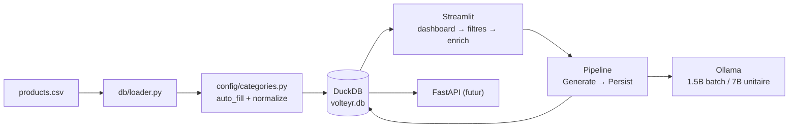

# Volteyr Agentic — Présentation

Système d'enrichissement de descriptions produits e-commerce par IA locale.

---

## 1. Contexte & Contraintes

**Exercice** : pré-entretien pour The Bradery — boutique e-commerce premium (Sandro, Maje, AMI Paris, etc.).

**Dataset** : export Shopify `products.csv` — 1000 produits, 8 colonnes, descriptions en français.

**État initial du catalogue** :

| Métrique | Valeur |
|---|---|
| Produits totaux | 1000 |
| Descriptions vides | 133 (13%) |
| Descriptions < 50 caractères | 367 (37%) |
| Descriptions 50-200c | 122 (12%) |
| Descriptions > 200c | 378 (38%) |
| Types de produits distincts | 402 |

Soit **50% du catalogue avec des descriptions insuffisantes ou vides** — impact direct sur le SEO et les conversions.

**Contraintes fortes** :
- Zéro cloud, zéro clé API : tout en local
- Machine : 16 Go RAM, Linux
- Stack imposée : Streamlit (UI) + FastAPI (API) + DuckDB (stockage)
- LLM local via Ollama, modèles open-source (Qwen2.5)
- 1 semaine de développement

---

## 2. Problématiques identifiées

### P1 — Normalisation des types produits
402 types de produits Shopify différents (« Pantalon », « Pants », « JACKET », « TEE SHIRT »…) → **12 catégories filtrables dans l'UI**. Sans normalisation, 400 filtres rendent l'interface inutilisable.

### P2 — Qualité des enrichissements
Le LLM doit produire des descriptions en français, sans inventer d'informations, avec un ton cohérent entre les générations. La sortie doit être parsable de façon fiable (pas de texte libre fragile).

### P3 — Architecture propre
La première version du projet avait été construite par ajouts successifs sans vision d'ensemble, résultant en un code « rafistolé » avec des dépendances croisées et une normalisation qui polluait tout le flux.

### P4 — Performance batch
L'enrichissement de plusieurs produits peut prendre plusieurs minutes. Il faut un suivi de progression, une gestion des échecs, et un modèle adapté à l'usage (batch vs unitaire).

---

## 3. Architecture

### 3.1 Monolithe modulaire par couche

```
src/
├── db/          → connexion DuckDB, schéma, repositories
├── llm/         → client Ollama, prompts, stratégies
├── enrichment/  → pipeline, factory, steps
├── config/      → normalisation des catégories
├── ui/          → Streamlit (composants)
├── api/         → FastAPI (modèles, futur)
└── cli/         → scripts de chargement
```

Chaque couche ne dépend que de la couche inférieure : `ui/ → enrichment/ → llm/ → db/`. Jamais l'inverse.

### 3.2 Design patterns

| Pattern | Où | Pourquoi |
|---|---|---|
| **Repository** | `db/product_repository.py`, `db/enrichment_repository.py` | Isole tout le SQL de l'UI. Les composants Streamlit n'ont jamais de `conn.execute()` — ils appellent des méthodes publiques du Repository. |
| **Strategy** | `llm/strategies.py` | Deux modèles interchangeables au runtime : `SmallModelStrategy` (qwen2.5:1.5b) pour le batch, `LargeModelStrategy` (qwen2.5:7b) pour l'unitaire. |
| **Factory** | `enrichment/factory.py` | Centralise la création d'objets `Enrichment` avec validation : description ≥ 20 caractères, champs par défaut « Non précisé ». |
| **Pipeline** | `enrichment/pipeline.py` | Orchestre les étapes : Generate → Persist. Le batching est intégré (`run(batch_size=5)`). `run_single()` utilise le grand modèle. |

### 3.3 Flux de données



---

## 4. Solutions clés

### 4.1 Normalisation sans LLM

**Problème** : 402 types Shopify → 12 catégories. La première approche envoyait tout au LLM, qui répondait « Autres » pour 100% des types (trop de données, modèle 1.5B incapable).

**Solution** : matching par mots-clés (`_simple_match()`) avec un dictionnaire de 12 catégories × ~15 mots-clés. Résultat :

| Méthode | Types | Progression |
|---|---|---|
| Regex match | 268 | 68% |
| Fallback « Autres » | 126 | 32% |
| Appels LLM | **0** | supprimé |

Le mapping est sauvegardé dans `config/categories.yaml` et persiste entre les chargements. Si un nouveau type apparaît, le regex tente de le matcher ; si échec → « Autres ». **Zéro latence, résultat instantané.**

### 4.2 Deux modèles Ollama

L'enrichissement batch (volume) utilise le petit modèle (1.5B, ~1 Go RAM), l'enrichissement unitaire (qualité) utilise le grand modèle (7B, ~4.5 Go RAM). Le switch est transparent via le pattern Strategy.

**Sortie JSON structurée** :

```json
{
  "enriched_description": "...",
  "material": "...",
  "care_instructions": "...",
  "style": "...",
  "seo_keywords": "..."
}
```

Contrairement aux sections `[DESCRIPTION]` / `[MATIERE]` fragiles de la v1, le `format: json` natif d'Ollama garantit un parsing fiable. En cas de JSON invalide → retry (1 tentative, soit 2 essais max par produit).

### 4.3 Gestion des échecs

Le pipeline d'enrichissement gère les échecs à chaque niveau :
1. **Client HTTP** (`llm/client.py`) : `requests.Session()` avec timeout de 30s (petit modèle) / 120s (grand modèle). Erreur réseau → retourne `None`.
2. **GenerateStep** (`enrichment/steps/generate.py`) : 1 retry si JSON invalide. Échec final → `None` dans la liste de résultats.
3. **PersistStep** (`enrichment/steps/persist.py`) : ne persiste que les résultats non-`None`. Le ré-enrichissement écrase l'ancien (delete + insert).

Dans l'UI, la barre de progression affiche `X OK, Y échecs` en temps réel.

### 4.4 CSV uploader intégré

L'utilisateur charge le CSV directement depuis l'interface Streamlit (pas besoin de lancer `load_data.py` en CLI). Au chargement :
1. Extraction des types produits uniques
2. Normalisation automatique via `auto_fill_categories()`
3. Nettoyage de la DB précédente (delete enrichissements → delete products)
4. Insertion des 1000 produits avec catégories normalisées

---

## 5. Itérations & Qualité

### 5.1 Workflow de développement

```
brainstorm → challenge → shadow-areas → prd → bootstrap → memory
    → implement (28 features, agents parallèles, ≤50 lignes/feature)
    → audit (7 piliers) → review (3 axes) → refactor (4 axes)
    → test (13 comportements, edge cases)
    → docs (5 modules, 1076 lignes)
```

### 5.2 Métriques

| Métrique | Valeur |
|---|---|
| Lignes de code source | 1 243 |
| Lignes de tests | 1 267 |
| Tests unitaires | **104** |
| Échecs / Skip | **0 / 0** |
| Commits | 69 |
| Fichiers source | 24 |
| Fichiers de test | 9 |

### 5.3 Règles respectées

- Chaque feature ≤ 50 lignes. Tolérance jusqu'à 100 lignes avec consultation pour Streamlit (composants UI).
- Les 2 fonctions au-dessus de 50 lignes (`search()` 73, `show_batch_enrich()` 65) sont des composants UI sous la barre des 100.
- Conventionnal commits (`feat:`, `fix:`, `refactor:`, `test:`, `docs:`)

---

## 6. Résultat

### Application Streamlit — 3 pages

| Page | Fonction |
|---|---|
| 📊 Tableau de bord | Métriques (total, vides, <50c, <200c), bar charts qualité/catégories/marques, preview |
| ✨ Enrichissement | Filtres combinés (qualité, catégorie, marque), table avec sélection multi-lignes et pagination, bouton d'enrichissement batch dans la sidebar |
| 📥 Export | Preview et téléchargement CSV des produits enrichis |

### Flux utilisateur complet

1. **Charger** le CSV Shopify via l'uploader dans la sidebar
2. **Visualiser** l'état du catalogue dans le dashboard
3. **Filtrer** par qualité / catégorie / marque pour cibler les produits
4. **Sélectionner** les produits à enrichir (pagination 50/lignes)
5. **Enrichir** : 1 produit → grand modèle (7B) / plusieurs → petit modèle (1.5B) en batch
6. **Exporter** les résultats en CSV

### API FastAPI — prête à être branchée

Les modèles Pydantic (`ProductResponse`, `SearchParams`, `SearchResponse`, `StatsResponse`) sont déjà définis dans `src/api/models.py`. Le endpoint de recherche (`GET /api/products/search`) s'appuiera sur `EnrichmentRepository.search()` qui existe déjà avec filtres full-text, catégorie, vendor et pagination.

---

## 7. Choix techniques justifiés

| Choix | Justification |
|---|---|
| DuckDB (pas PostgreSQL) | Zéro configuration, fichier unique, idéal pour 1000 lignes en local |
| Ollama (pas OpenAI) | Exercice impose zéro clé cloud. Qwen2.5 tient en RAM sur 16 Go |
| JSON structuré (pas texte libre) | Parsing fiable vs regex fragile sur `[DESCRIPTION]`. Le `format: json` d'Ollama est natif |
| Regex (pas LLM) pour normalisation | Le LLM 1.5B ne catégorise pas correctement 400 types. Le regex matche 68% instantanément |
| Pas d'ORM | DuckDB est déjà Python natif. Un ORM serait du surpoids pour un projet de cette taille |
| Singleton connexion DB | Évite les connexions multiples au même fichier. DuckDB est single-writer |
| Monolithe modulaire | 1 développeur, 1 semaine. Les microservices n'ont pas de sens. La séparation par couche suffit |
